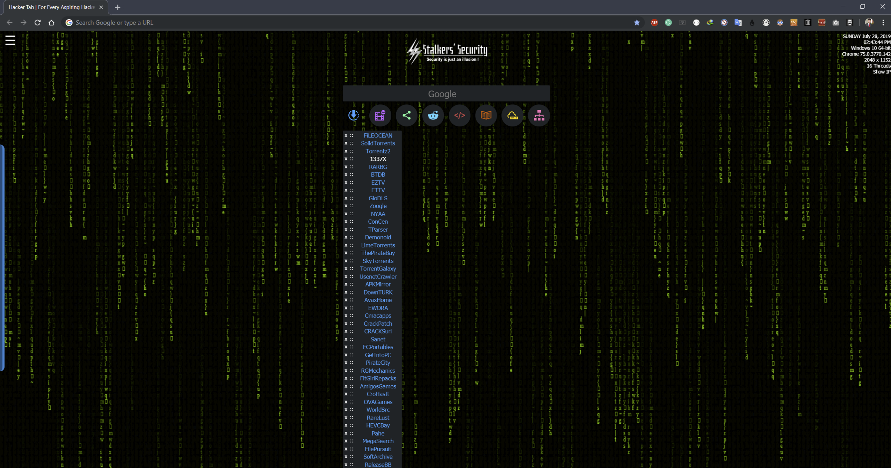

# HackerTab
Animated Customizable Color Matrix Theme and Frequently Used Weblinks for Google Chrome

## Description
This extension is a Matrix based animated theme with many search engines and Mr. Robot Wallpapers. 
It adds the hacker look to your Chrome New Tab. 

<b>Setting Menu</b> can be accessed by moving cursor to left edge. 
<b>Matrix can be customized to any colour </b>of your liking through a colour picker. There are <b>Mr. Robot Wallpapers</b> are built in but any other wallpaper can be used from <i>'Custom Wallpaper'</i> button.

### Screenshots

#### Search Engines available are :
<ul>
<li>Google</li>
<li>DuckDuckGo</li>
<li>Torrentz</li>
<li>TOR / Onion</li>
<li>Bing</li>
<li>SearchEncrypt</li>
<li>StartPage</li>
<li>SwissCows</li>
<li>SearX</li>
<li>Quant</li>
<li>FindAlternative</li>
</ul>

 #### It has lists of weblinks of different categories :
<ul>
<li>Torrents</li>
<li>Media / Streamers</li>
<li>Social Networks</li>
<li>Reddit Forums</li>
<li>Developer Resources</li>
<li>News / Books</li>
<li>Cloud Sources</li>
<li>Internet Services</li>
</ul>

## FAQs
#### How do I access Menu ?
Menu can be accessed by moving cursor to the Left Edge of Theme. A button to open menu is also placed placed in Top-Left Corner.
#### How do I change colour of matrix ?
<i>Change Colour</i> option is available in Menu.
#### How do I change background to a wallpaper ?
<i>Change Background</i> option is available in Menu.
#### How do I change background pattern ?
<i>Change Animation</i> option is available in Menu.

